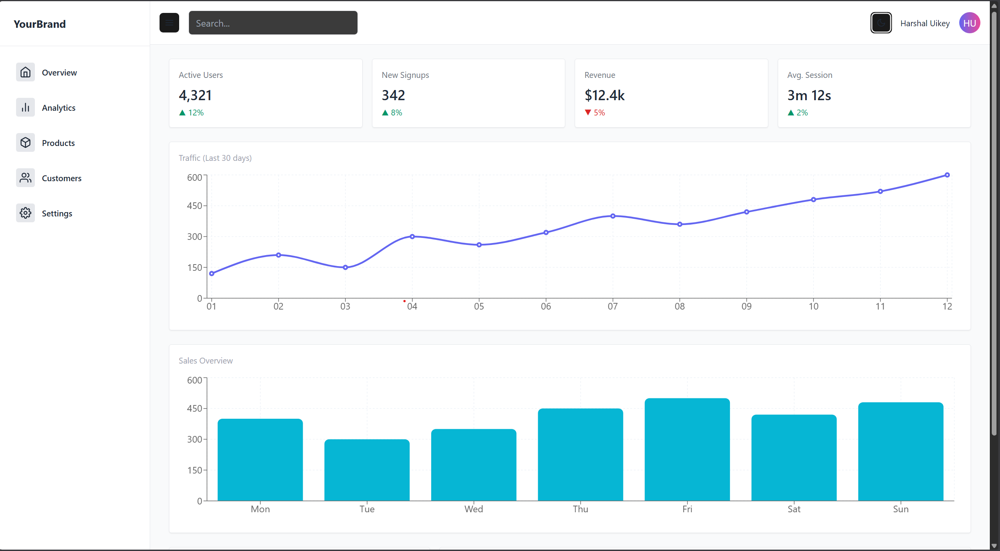
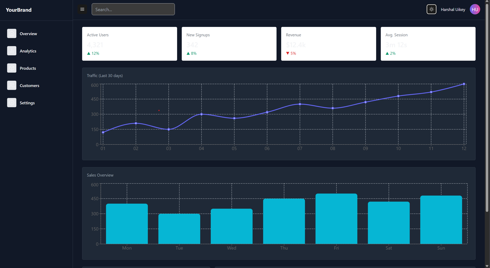
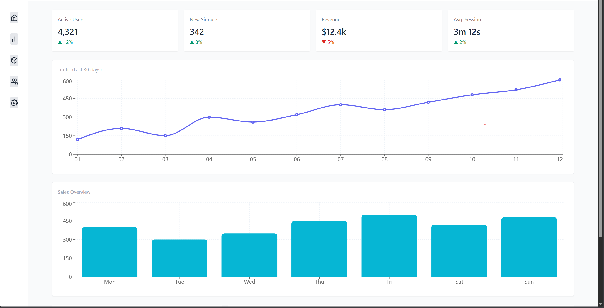

#  SaaS Dashboard Web App  
A modern and responsive **analytics dashboard** built using **React**, **Vite**, **Tailwind CSS**, and **Recharts**.  
This project is designed to demonstrate real-world frontend engineering skills, including responsive UI design, component architecture, chart visualization, and clean dashboard layouts 

---

## Screenshots

### Dashboard (Light Mode)

### Dashboard (Dark Mode)

### Collapsible Sidebar

---
## LIVE DEMO

##  Features

###  Sidebar Navigation  
- Collapsible sidebar with smooth transitions  
- Icon-based navigation  
- Responsive UI for mobile & desktop  

###  Topbar + UI Controls  
- Search bar layout  
- Light & Dark mode toggle  
- User avatar placeholder  

### Data Visualization  
- **Line Chart** for traffic analytics  
- **Bar Chart** for sales trends  
- Built with responsive **Recharts** components  

###  Dashboard Modules  
- KPI Stats Cards  
- Recent Activity List  
- Users Table  
- Card-based layout structure  

###  Tailwind CSS UI  
- Modern, utility-first styling  
- Smooth spacing, shadows, and color palettes  
- Fully responsive grid design  

---

##  Purpose of This Project  
This project demonstrates:

- Modern frontend development using **React + Tailwind**  
- Building clean, responsive SaaS-style dashboards  
- Designing reusable components  
- Visualizing data using interactive charts  
- Applying UI/UX patterns used in real applications  

---

##  What I Learned

- Structuring projects with a component-based architecture  
- Implementing responsive UI using Tailwind CSS  
- Rendering charts using Recharts  
- Handling UI state (dark mode, sidebar collapse)  
- Debugging layout issues & using `flex`, `grid`, and `min-w-0`  
- Designing professional dashboard layouts  

---

##  Tech Stack

### Frontend
- React  
- Vite  
- Tailwind CSS  
- Recharts  
- React Icons  

### Tooling
- ESLint  
- PostCSS  
- Vite Dev Server  

---

## 📂 Folder Structure
saas-dashboard/
│
├── public/
│
├── src/
│ ├── components/
│ │ ├── Sidebar.jsx
│ │ ├── Topbar.jsx
│ │ ├── StatsCard.jsx
│ │ ├── LineChartComp.jsx
│ │ ├── BarChartComp.jsx
│ │ └── Dashboard.jsx
│ ├── App.jsx
│ ├── main.jsx
│ ├── index.css
│
├── package.json
├── vite.config.js
├── tailwind.config.cjs
├── postcss.config.cjs
└── README.md

## Future Improvements

- Persistent theme storage
- More charts (Area, Pie, Radar)
- Backend API for real analytics
- Routing for multiple dashboard pages
- User authentication system
- Deploy to Verce

##  Author
Harshal Uikey

